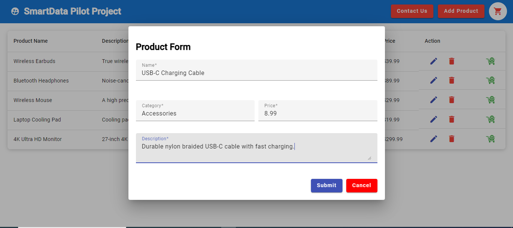
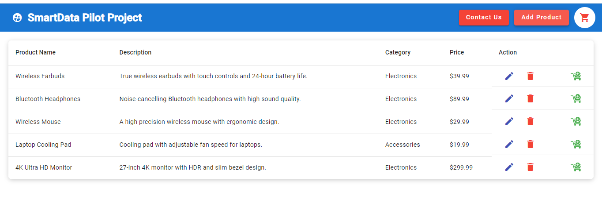
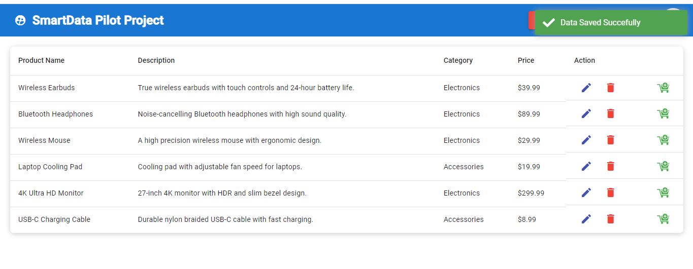
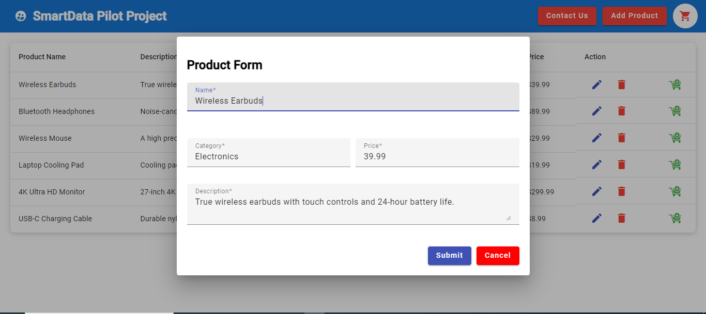
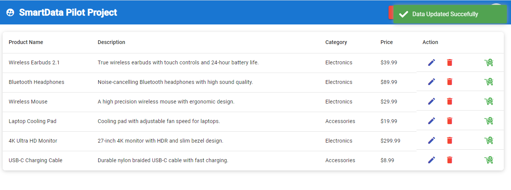
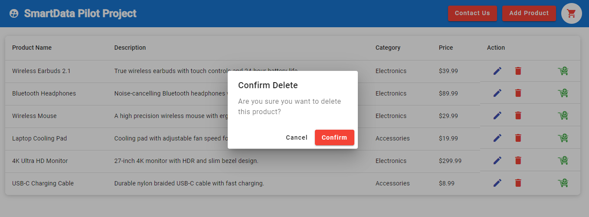
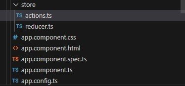
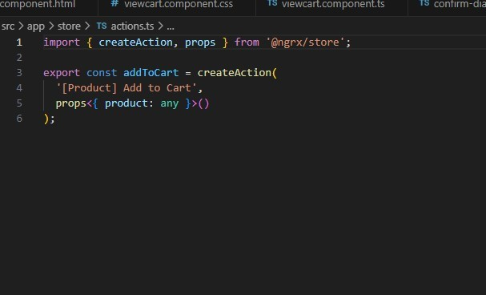
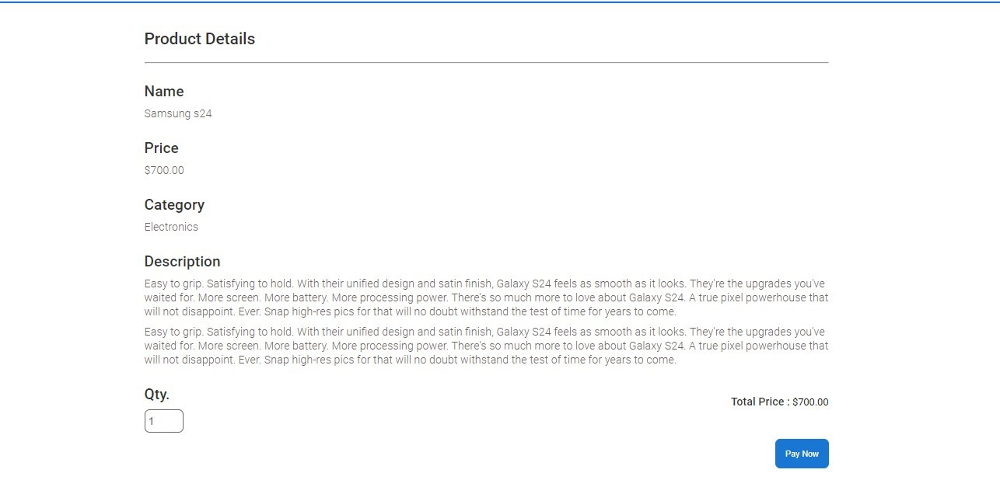
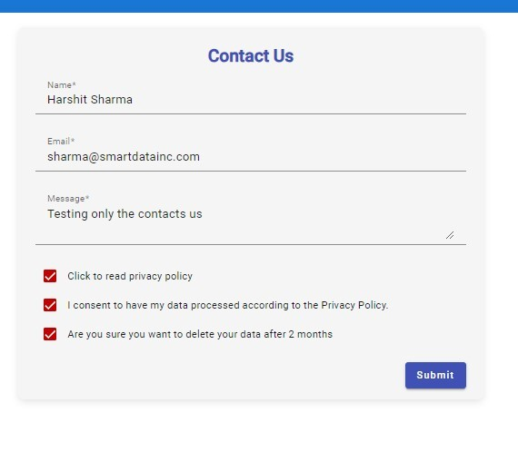

# Full-Stack Web Application: Angular, .NET Core 8, and MongoDB

This repository contains a full-stack web application built using Angular (Frontend), .NET Core 8 (Backend), and MongoDB (Database) using  compound indexes. The application is designed with scalability, security, and separation of concerns in mind. It uses CQRS for clear separation between command and query responsibilities.

## Architecture Overview

- **Frontend**: Angular (Latest Version 18) handles UI, client-side logic, and communication with the backend.
- **Backend**: .NET Core 8, using clean architecture with CQRS pattern, handles server-side logic and communication with the database.
- **Database**: MongoDB is used for storing data and use compound indexes, with encryption mechanisms to ensure data security.

## Features

- **Product Entity CRUD Functionality**: Users can create, update, read, and delete products.
- **GDPR Considerations**: Contact Us form stores user data in an encrypted format.
- **Redux**: Implemented in the product cart page for state management.
- **MongoDB**: Integration with compound indexes for optimized queries.
  
## Project Screenshots

### 1. Product Add Page


### 2. Product List Page


### 3. Product Saving Toaster


### 4. Product Update Popup


### 5. Product Update Toaster


### 6. Delete Confirmation


### 7. Redux on Product Cart Page




 

### 8. Contact Us Form (GDPR Compliant)


## Getting Started

### Prerequisites

- Angular 18 (Frontend)
- .NET Core 8 SDK (Backend)
- MongoDB (Database)


### Running the Application

Once the backend and frontend are running, open your browser and navigate to:

```
http://localhost:4200
```

### API Endpoints

- **GET /api/products**: Fetch a list of products
- **POST /api/products**: Add a new product
- **PUT /api/products/{id}**: Update an existing product
- **DELETE /api/products/{id}**: Delete a product

## Technologies Used

- **Frontend**: Angular 18
- **Backend**: .NET Core 8 ( Clean Architecture with CQRS Pattern)
- **Database**: MongoDB
- **Encryption**: AES encryption for sensitive data for GDPR 

